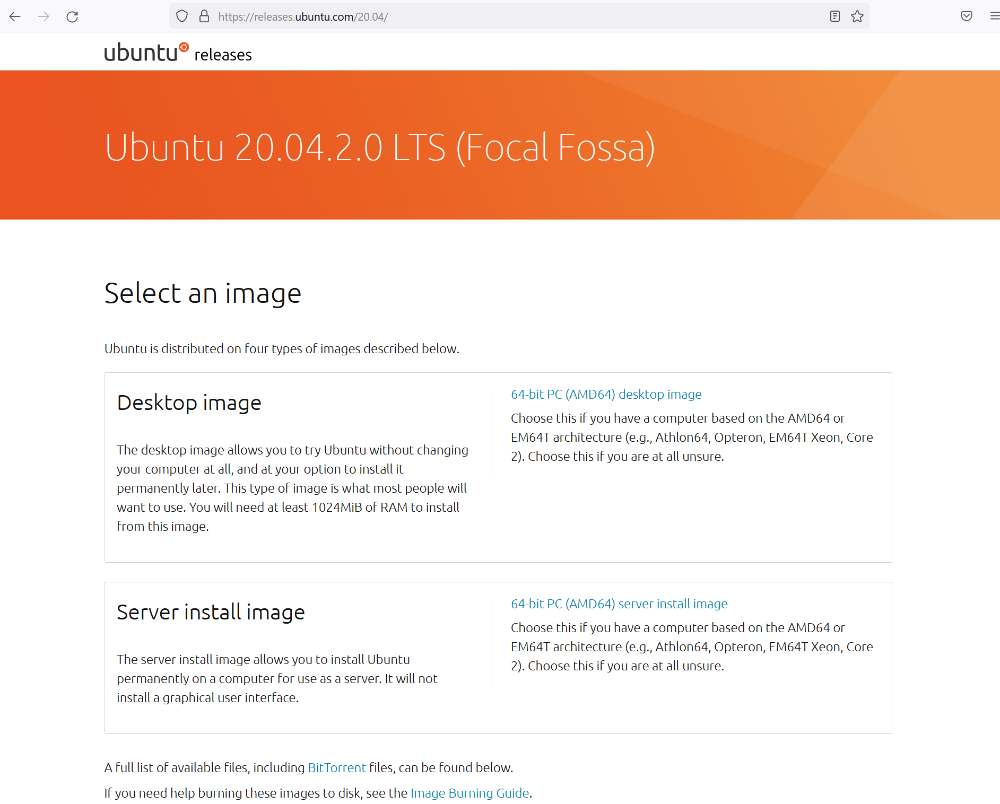
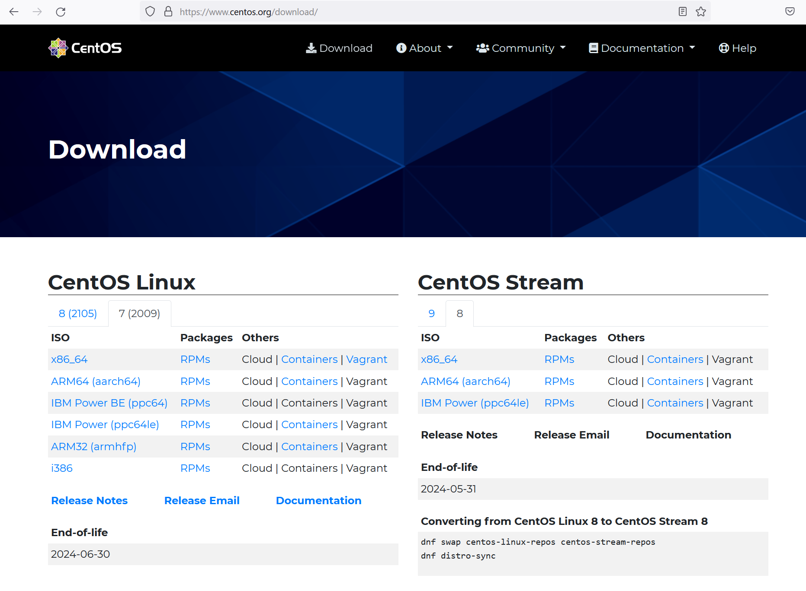
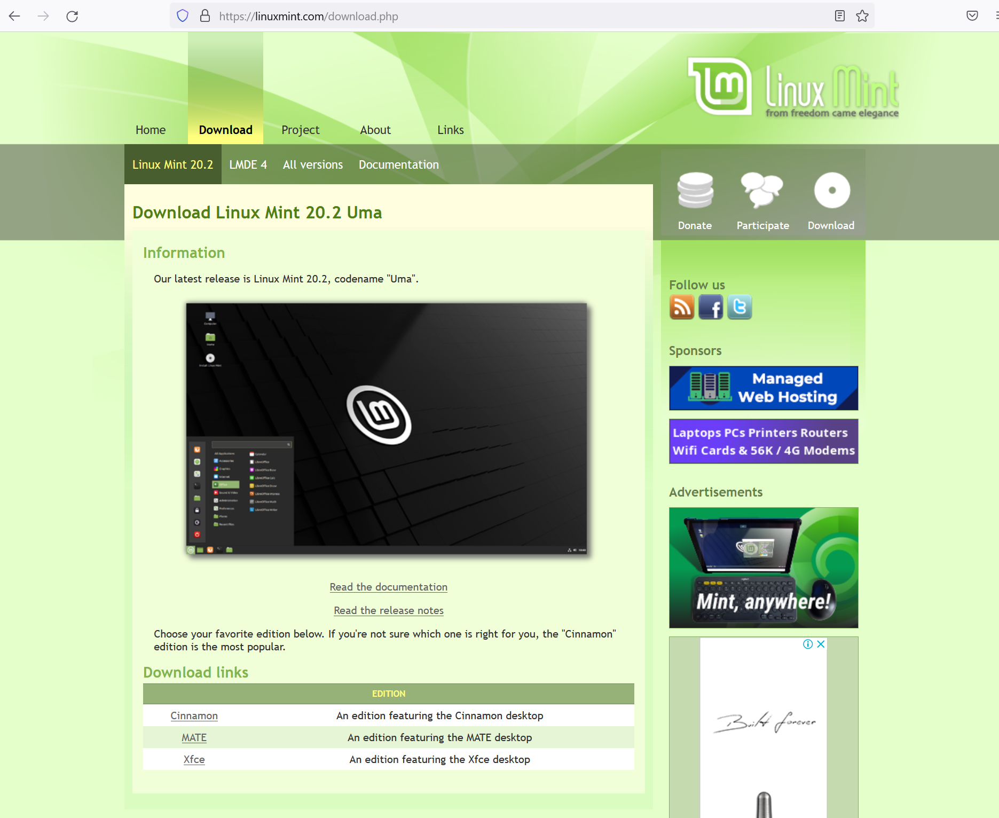
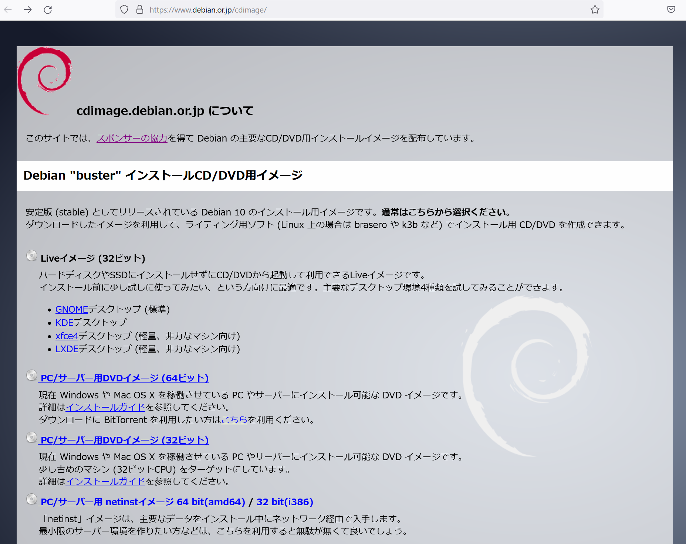

# Linux(OS)イメージの取得

OSイメージの取得方法について

## 共通事項
命令セットアーキテクチャ、CPUのbit数等から自分の環境にあったISOイメージをダウンロード
 x86プロセッサで、64ビットのPCの場合`CentOS-7-x86_64-DVD-2009.iso`のようなイメージをダウンロードすると良い

## ISOイメージとは
CDやDVDなどのディスク内のデータを一つにまとめたファイル
 一般的にLinuxなどのフリーOSはこのディスクイメージとしてインターネット上で配布されているのでこれを利用する
 ※仮想環境ではなく新たなPCにOSをインストールする場合はディスクイメージをDVDやUSBメモリに書き込んでインストールを行う必要がある

## Ubuntu
[ubuntuのダウンロード](https://releases.ubuntu.com/20.04/)ページにアクセス 
  

この中から環境にあったISOイメージをダウンロードする

## Centos
[centosのダウンロード](https://www.centos.org/download/)ページにアクセス 
  

この中から環境にあったISOイメージをダウンロードする

## Linux mint
[Linux Mintのダウンロード](https://linuxmint.com/download.php)ページにアクセス 
  

この中から環境にあったISOイメージをダウンロードする

## Debian
[Debianのダウンロード](https://www.debian.or.jp/cdimage/)ページにアクセス 
  

この中から環境にあったISOイメージをダウンロードする

## 参考
- [ubuntuのダウンロード](https://releases.ubuntu.com/20.04/)
- [centosのダウンロード](https://www.centos.org/download/)
- [Linux Mintのダウンロード](https://linuxmint.com/download.php)
- [Debianのダウンロード](https://www.debian.or.jp/cdimage/)
