# ubuntuサーバのインストール方法
ubuntu20.04 server install imageのインストール方法について
 今回はvirtual boxにインストール(インストール用メディア(ブータブルUSB等)の作成方法等の記載はない)

## 下準備

[VBの仮想マシン起動設定](../../VirtualBox/VB_settings.md)

## インストール手順

1. 起動
- (PCの場合)  
  インストール用メディアをマウントしPCを起動する 
- (仮想環境の場合) 
  ISOイメージをそのままマウントし仮想マシンを起動する

2. 言語設定 
  使いたい言語を選択し`Enter`を押す
  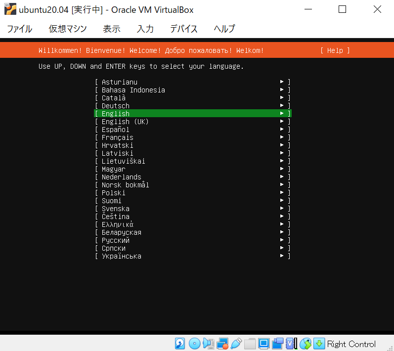

3. キーボード設定 
  使用するキーボードのレイアウトを選択しDoneで`Enter`を押す 
  今回は両方English(US)とした 
  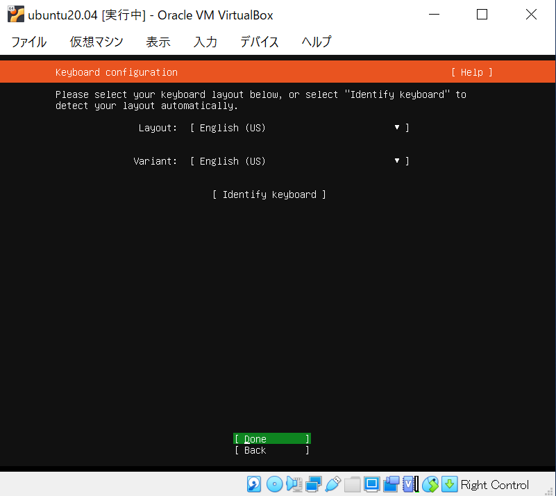

4. ネットワーク設定 
  ネットワークの初期設定はDHCP自動的にIPアドレスが取得できる設定になっている 
  必要に応じて設定を変更してDoneで`Enter`を押す
  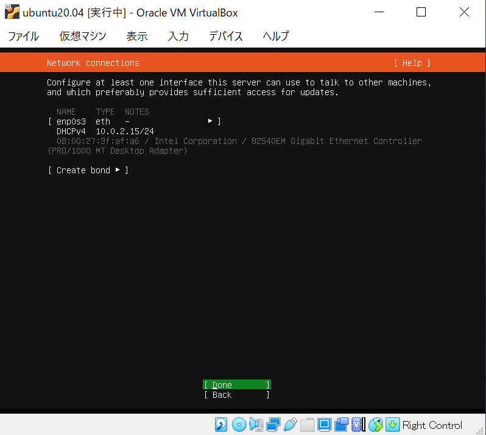

5. プロキシ設定 
  プロキシサーバを設定する必要がある場合は、address部分にプロキシサーバのアドレスを入力 
  設定が良ければDoneで`Enter`を押す
  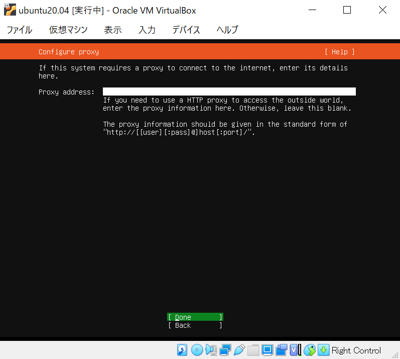

6. ミラーサーバ設定 
  ミラーサーバの設定を行う 
  必要に応じてサーバのURLを変更してDoneで`Enter`を押す
  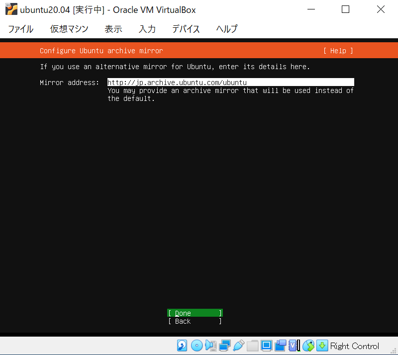

7. インストールするディスク指定 
  OSをインストールするストレージを選択 
  複数のディスクが接続されている場合は必要に応じてストレージの変更をしてDoneで`Enter`を押す 
  ※手動でパーティションを設定するには、Custom storage layoutにチェックをつける
  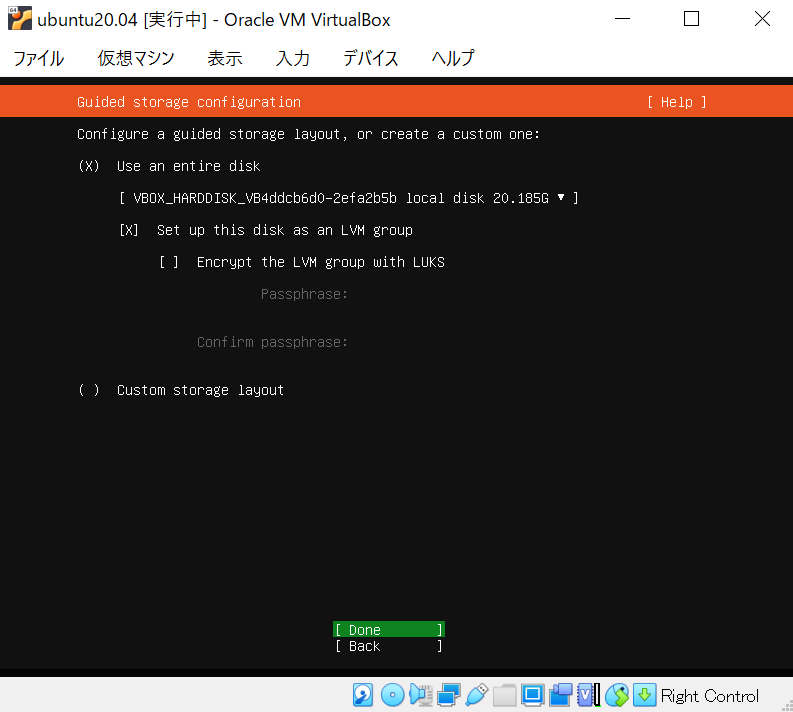

8. ストレージ設定 
  ストレージ設定内容が表示される 
  問題がなければDoneで`Enter`を押す
  

9. インストール処理の開始 
  インストール処理の実行許可を求める確認メッセージが表示されるので 
  問題がなければContinueで`Enter`を押す
  ※インストールが開始されると、7.で指定したストレージ内のデータが消去されてしまうので注意
  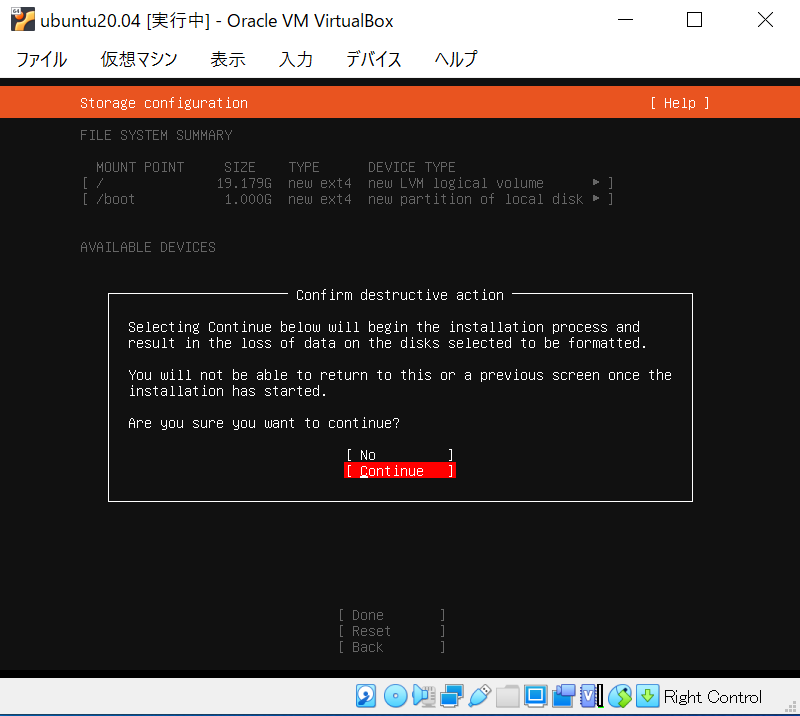

10. ユーザ作成 

  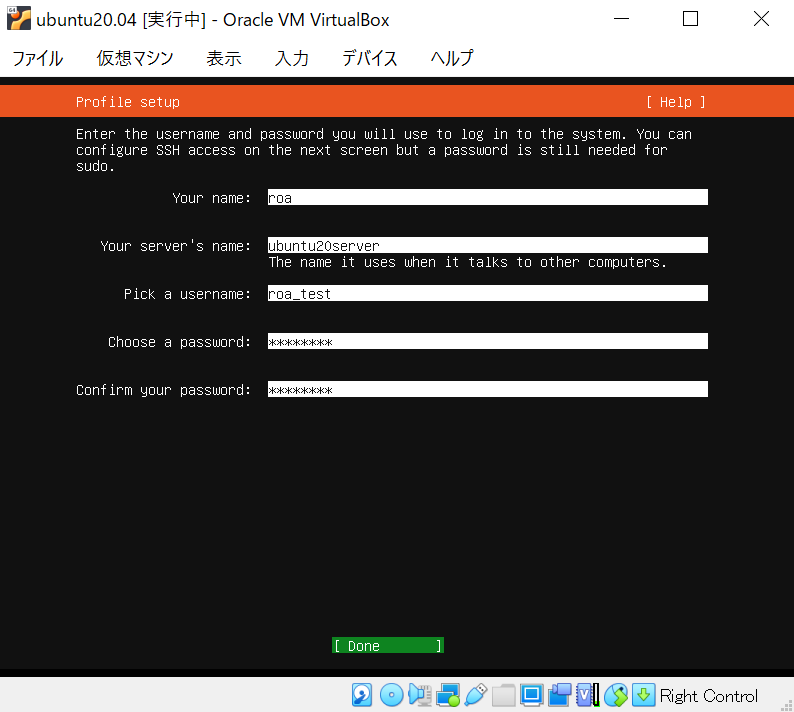

11. ssh設定 

  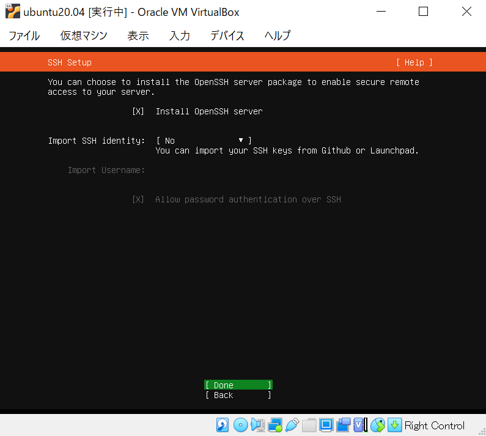

12. インストールパッケージ選択 

  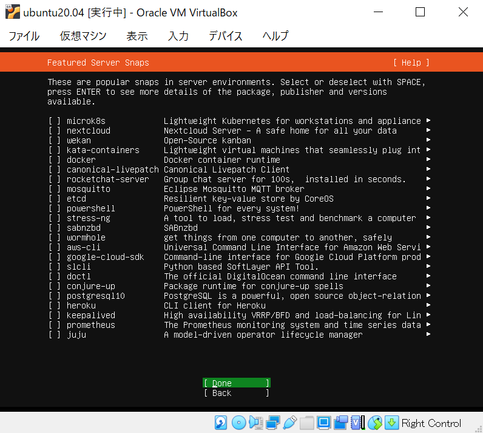

13. インストール処理 

  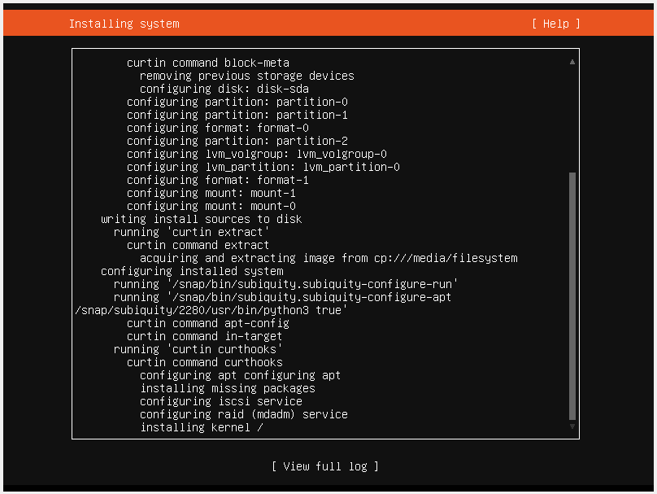

14. インストール完了->再起動 

  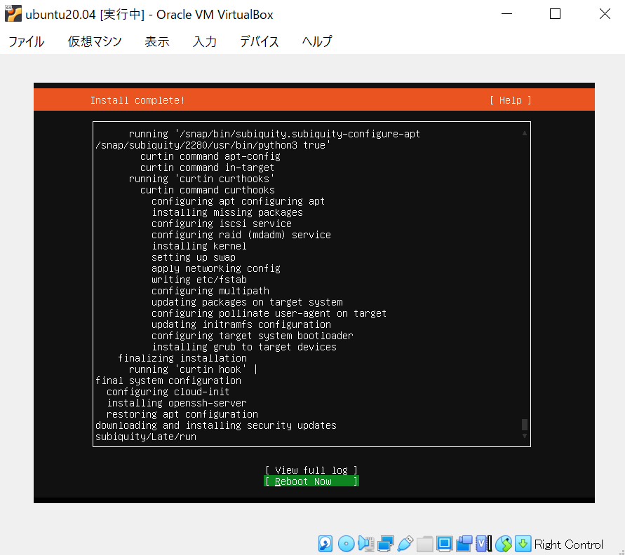

15. Fail unmounting \cdrom.エラー 

  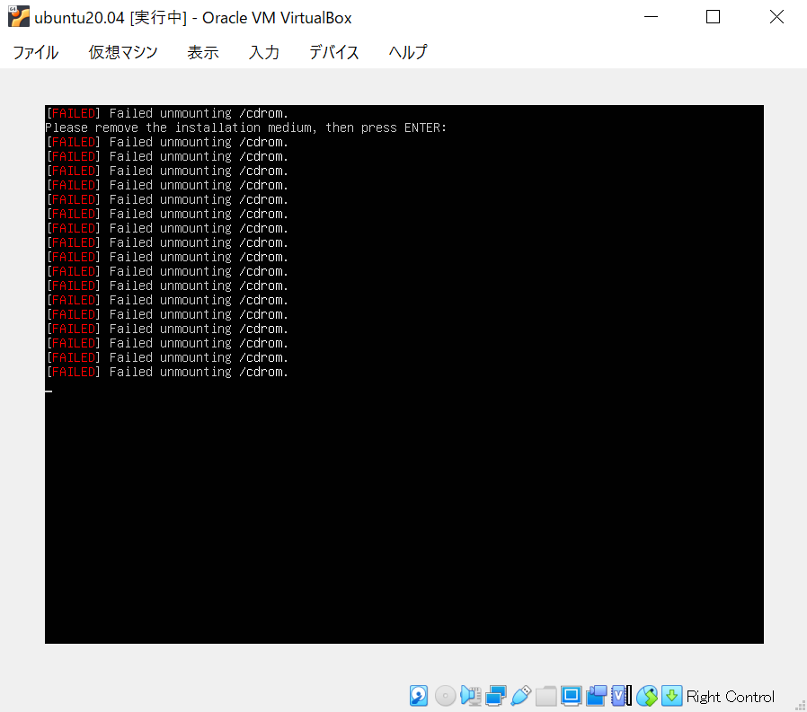

16. ログイン画面 

  

## 次の項目
[ubuntuの初期設定](./init_setting.md)

## 参考
- [ubuntu](https://ubuntu.com/server/docs/installation)
