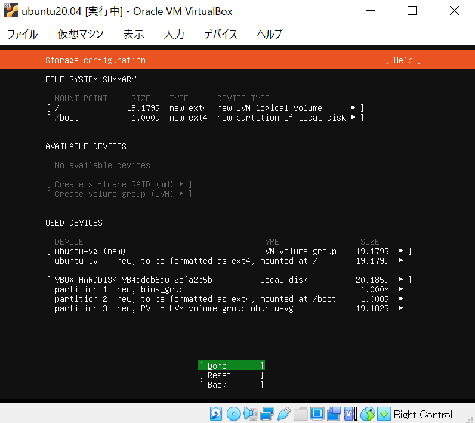

# ubuntuサーバのインストール方法
ubuntu20.04 server install imageのインストール方法について
 今回はvirtual boxにインストール(インストール用メディア(ブータブルUSB等)の作成方法はない)

## 下準備

[VBの仮想マシン起動設定](../../VirtualBox/VB_settings.md)

## インストール

1. 起動

  
2. 言語設定

  

3. キーボード設定

  

4. ネットワーク設定

  

5. プロキシ設定

  

6. ミラーサーバ設定

  

7. インストールするディスク指定

  

8. ストレージ設定

  

9. インストール処理の開始

  

10. ユーザ作成

  

11. ssh設定

  

12. インストールパッケージ選択

  

13. インストール処理

  

14. インストール完了->再起動

  

15. Fail unmounting \cdrom.エラー

  

16. ログイン画面

  

## 次の項目
[ubuntuの初期設定](./init_setting.md)
