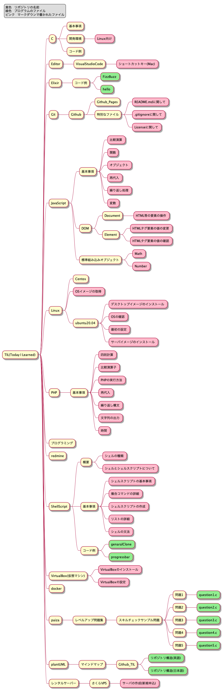

# TIL (Today I Learned)

毎日の勉強内容を、ただつらつらまとめていくためだけのリポジトリ。
欲を言えばいつの日か、誰かの参考になればなと思っています。

## TIL更新のための作業メモ（自分用）
1. TILリポジトリのクローン（cloneTIL.shの実行）
2. 勉強した内容の追加（ファイルの追加）
3. ~~TILtree.txtの更新 ~~4でまとめて更新できるように変更
<br>~~```.../TIL $ tree > TILtree.txt```~~
4. RepositoryStructure.png, RepositoryStructureJ.pngの更新
<br>```.../plantUML/MindMap/Github_TIL $ ./updateRepoSt.sh```

他にあったかな…

## TIL内フォルダの構成

|||
|:---:|:---:|
|Repository Structure|リポジトリ構成|
