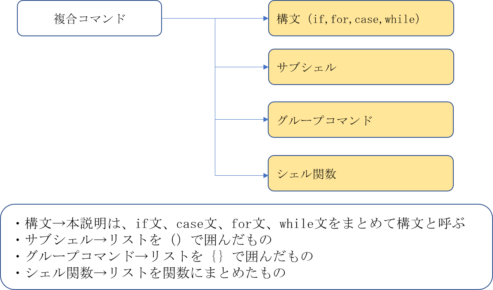

# CompoundCommand

複合コマンドの詳細（以下４項目）について
- 各構文(if, for, case, while)
- サブシェル
- グループコマンド
- シェル関数

 

## if文
if で始まり fi で終わる。
<br>caseを()で囲むこともできるが、サブシェルと紛らわしくなる

```
if ["$i" -eq 3]     $iと3の数値を比較（= -eq）
then
  echo 'iの値は3です'
elif ["$i" -eq 5]
then
  echo 'iの値は5です'
else
  echo 'iの値は3でも5でもありません'
fi  
```

ifの直後のリストとしてcmpコマンドを使った例
```
if cmp -s file1 file2
then
  echo 'file1とfile2の内容は同じです'
else
  echo 'file1とfile2の内容は異なります'
fi
```

if[...]のスタイル
```
cmp -s file1 file2
if [$? -eq 0]
then
  echo 'file1とfile2の内容は同じです'
fi
```

ifの直後にリストにcmpと[]の両方を記述
```
if 
  cmp -s file1 file2
  [ $? -eq 0]
then
  echo 'file1とfile2の内容は同じです'
fi
```

ifの条件判断を逆に
```
if cmp -s file1 file2; [$? -ne 0]     $?の値が0でない場合に真になる
then
  echo 'file1とfile2の内容は異なります'
fi
```

## case文
case で始まり esac で終わる。

```
case $1 in     #シェルスクリプトの第1引数によって条件分岐
  start)
    echo 'start'
    ;;
  stop)
    echo 'stop'
    ;;
  *)
    echo 'input start or stop'
    ;;
esac
```

コマンド置換の文字列によって分岐
```
case `uname -s` in
  Linux)
    echo 'this is Linux'
    ;;
  FreeBSD)
    echo 'this is FreeBSD'
    ;;
  SunOS)
    echo 'this is Suolaris'
    ;;
  *)
    echo 'this is other OS
    ;;
esac
```

ＯＲ条件のパターンを使った例
```
case `uname -s ` in
  Linux|FreeBSD)
    echo 'this is Linux or FreeBSD'
    ;;
  *)
    echo 'this is other OS'
    ;;
esac
```

caseの代わりにifを使用
```
if ["$1" = start]
then
  echo 'start'
elif ["$1" = stop]
then
  echo 'stop'
else
  echo 'input start or stop'
fi
```

リストの継続実行(C言語のswitch文のbreakを省略したものに相当)
```
case $var in 
  one)
    echo 'if $var is one'
    ;&
  two)
    echo 'if $var is two'
    ;;
esac
```

パターンの継続検索
```
case $var in 
  one)
    echo 'if $var is one'
    ;;&
  two)
    echo 'if $var is two'
    ;;&
  *)
    echo 'すべての場合'
    ;;
esac
```

## for文
## while(until)文
## サブシェル
## グループコマンド
## シェル関数

これはbash特有の複合コマンドでまとめようかな、、、
## select文(bashのみ)
## 算術式のfor(bashのみ)
## 算術式の評価(())(bashのみ)


