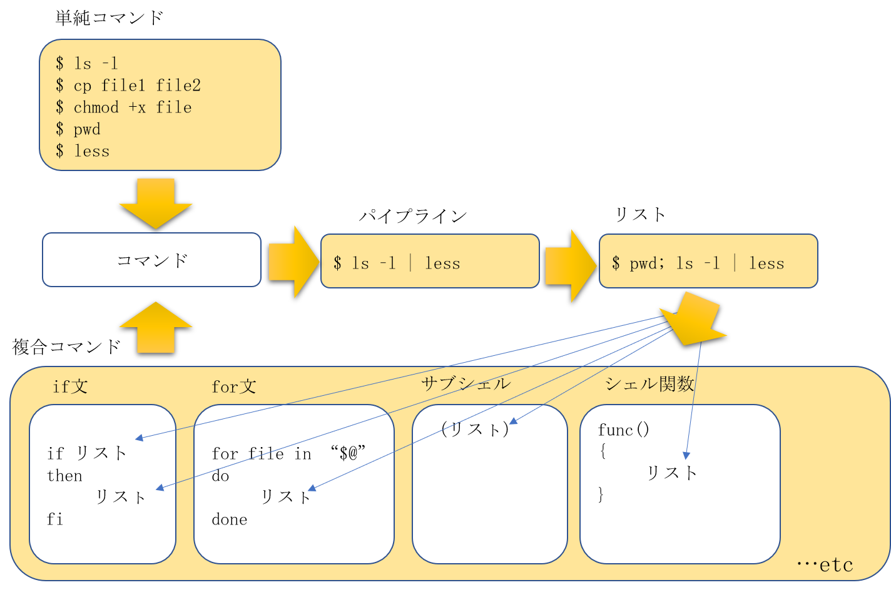

# ShellGrammar

シェルの文法について（用語と循環構造）
- 単純コマンド
- 複合コマンド
- コマンド
- パイプライン
- リスト

<br>コマンド
<br>-> コマンドをつなげたパイプライン 
<br>-> 1つ以上のパイプラインがつながったリスト 
<br>-> リストを複合コマンドに利用 
<br>-> 複合コマンドも一つのコマンド

## 用語と概念図
<br>**単純コマンド** : 普通の意味でコマンドと呼んでいるもの
<br>**複合コマンド** : if, for, サブシェル, シェル関数等（あくまでまとまりが一つのコマンド）
<br>**パイプライン** : ｜（パイプ）でつながったもの
<br>**リスト** : 1つ以上のパイプラインが;か改行でつながったもの
<br>**循環構造** : コマンド→パイプライン→リスト→複合コマンド→コマンド… のつながり

 

## 単純コマンド

<br>基本事項

- コマンド名と０個以上の引数を、スペースなどで区切って並べたもの
- 実行されたコマンドの終了ステータスそのものが単純コマンドの終了ステータス

<br>簡単な区分

| 外部コマンド   | 組込みコマンド（内部コマンド） |
| -------- | --------------- |
| cp, lsなど | cd, echoなど    |


## 複合コマンド

<br>基本事項

- if文, case文, for文, while文, サブシェル, グループコマンド, シェル関数のこと
- 複合コマンドの終了ステータスは、各複合コマンドの仕様によって決められる

<br>例

```
    for n in 1 2 3 4 5
    do
      echo 'Hello World'
    done > newfile     #以上をnewfileというファイルに書き込む
```

<br>※Linux（bash）では、算術式のfor文, select文, 算術式の評価, 条件式の評価も、文法上複合コマンドと解釈される

## コマンド

<br>基本事項

- 単純コマンドまたは複合コマンドのこと
- コマンドの仕様によって終了ステータスは変わる

<br>いわゆるUNIXコマンドについて

- /bin, /usr/bin, /usr/local/bin等のディレクトリにインストールされているのが普通
- これらのディレクトリにあればコマンドとして実行できる
- パスが通っていれば、type lsというコマンドでlsコマンドの存在を確認できる
- man lsというコマンドはlsのオンラインマニュアルを確認できる

## パイプライン

<br>基本事項

- 1つ以上のコマンドをパイプ（ | ）で区切って並べたもの
- ex)$ ls -l | less     lsコマンドの出力をパイプでlessに接続
- 左側のコマンドの標準出力は、右側のコマンドの標準出力にパイプで出力される
- パイプラインの中の最も右側（最後）のコマンドの終了ステータスがパイプラインの終了ステータスになる

<br>例
```
$ who | grep -p '^guest\>'     #guestがログインしているかチェック
$ echo $?     #終了ステータスの表示
0     #(真である)

パイプラインの否定演算
$ who | grep -p '^guest\>'     #guestがログインしているかチェック
$ echo $?     #終了ステータスの表示
0     #(真である)

$ ! who | grep -p '^guest\>'     #guestがログインしていないかチェック
$ echo $?     #終了ステータスの表示
1     #(偽である)

パイプラインのコマンド終了ステータスを個別に表示（bashのみ）
$ (exit 3) | (exit 4) | (exit 5)    #終了ステータス3,4,5を返すパイプラインの実行
$ echo ${PIPESTATUS[@]}     #配列型のシェル変数PIPESTATUSの内容を一括表示
3 4 5

標準エラー出力もパイプに通す方法（bashのみ）
例１
$ make |& tee make-log    #makeコマンドの標準出力を標準エラー出力も含めてteeコマンドにパイプで渡す
例２
$ make 2>&1 | tee make-log    #makeコマンドの標準出力を標準エラー出力も含めてteeコマンドにパイプで渡す(ファイル記述子の複製を利用)

```

## リスト

<br>基本事項

- 1つ以上のパイプラインを、改行、;、&、&&、||で区切って並べたもの
- ex)$ cd /some/dir;  ls -l     cdとlsという二つのパイプラインが;で区切って並べられ1つのリストになっている
- リストの最後に改行、;、;&がつけることができ、これらがついたリストを終端されたリストと呼ぶ
- 各パイプラインは左から右に順番にフォアグラウンドで実行される
- &で区切られているか終端されている場合はバックグラウンドで実行される
- &&または||で区切られている場合&&、||は改行、;、&よりも高い優先順位で評価される
- リストの中で最後に実行したパイプラインの終了ステータスがリストの終了ステータスになる
- 最後のパイプラインがバックグラウンドで実行された場合は終了ステータスは０になる

```
ls -l     #lsコマンドはそれ自体がパイプラインかつリスト
cd /dir; ls     #これはリストだが、コマンドやパイプラインではない
{cd /dir; ls;}     #グループコマンドにするとコマンドやパイプラインにもなる
```

〇正しい例

```
ls -l
    
cp file1 file2
```

×誤った例

```
ls -l
;
cp file1 file2
```
