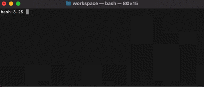
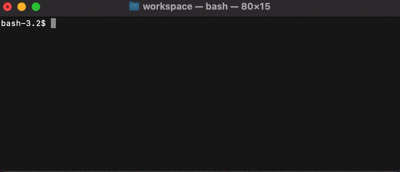

# generalClone

任意のgithubリポジトリをコマンドラインからクローンできる

## generalClone.sh

- 任意のgithubリポジトリをコマンドラインからクローンするシェルスクリプト
- `git clone https://github.com/hogehoge/hugahugahuga.git` 様に打たなくて済む
- シェルスクリプトの実行、対象ユーザーネーム及びリポジトリの入力のみで簡単にクローン
- 現在の自分のパソコンで利用しているgitアカウントが確認でき、必要に応じて変更可能
 
## デモ


<br>（クローンの様子）


<br>（ユーザーネームとユーザメールの変更）

## 必要なツール等
- git

## 使用方法

コマンドライン上で
```
$ chmod +x generalClone.sh
$ ./genaralClone
```

## Author
[sudo-roa](https://github.com/sudo-roa)
