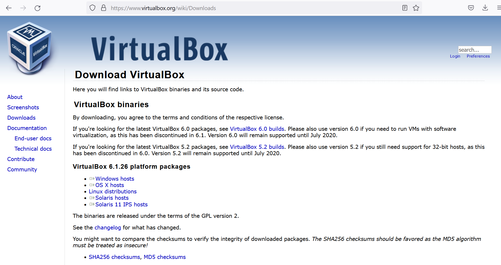
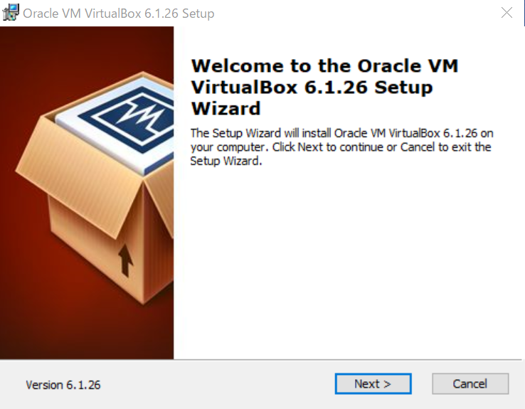

# VirtualBoxのインストール

oracle VirtualBoxのダウンロードからインストールまで
<bt>今回はwindows環境を利用しました

## ダウンロード
1. [VirtualBox](https://www.virtualbox.org/) の公式ページにアクセス
    

2. [download](https://www.virtualbox.org/wiki/Downloads/) のロゴをクリックして、ダウンロードページに進む
  
  
3. このページのplatform packagesからインストール先のホスト環境(今回はwindows)にあったものをダウンロードする
   (今回の場合、VirtualBox-6.1.26-145957-Win.exeファイルをダウンロード)
  

## インストール
1. ダウンロードしたファイル(VirtualBox-6.1.26-145957-Win.exe)をダブルクリック等で実行する
   -> setup wizardが起動し以下のような画面が表示される
  
  
2. ウィンドウの案内に従ってNextを押す
   -> 以下のようなインストールする機能の選択画面に遷移 この画面ではインストールする機能をカスタムすることができる
  

3. カスタムは基本的に不要なのでNextを押して次へ
   -> 以下のようなオプション選択画面に遷移し、上から
  - スタートメニューに含めるか
  - ショートカットをデスクトップに作成するか
  - クイックローンチバー(使ったことないからよくわからない)にショートカットを作成するか
  - ファイルの関連付け登録をするか(拡張子が.vboxにvirtualboxを関連づけるかどうか)
   の項目となっている
  

4. 必要はオプションにチェックを入れてNextを押す
   -> 以下のようなネットワークに関する警告画面に遷移 この画面ではVirtualBoxのインストール中にネットワークが切断されるという警告を表示している
  
  
5. ネットワークが途切れて問題がなければyesを押す
   -> 以下のようなインストール準備完了画面に遷移 この画面でInstallを押せばインストールが開始される
   ※インストール時にデバイスへの変更を加える許可を求める画面が出るのではいを押して許可をする
  
  

6. インストールが始まったら数分待機
   -> インストールが完了すると以下のようなインストール完了画面に遷移 
  

7. finishを押してインストールを終了

## 次の項目
- [VBで仮想マシンの起動設定](./VB_settings.md)
- [Linux(OS)イメージの取得](../Linux/get_OS_images.md)

## 参考
- [Oracle VM VirtualBox](https://www.virtualbox.org/)

