# VBで仮想マシンの起動設定

VBインストール後の仮想マシン起動のための最小限の設定について

## 下準備
- [VirtualBoxのインストール](./VB_installation.md)
- [Linux(OS)イメージの取得](../Linux/get_OS_images.md)

## 手順
1. Oracle VM VirtualBoxの起動
下準備の項目でインストールしたVirtualBoxを起動する

2. 仮想マシンの新規作成

  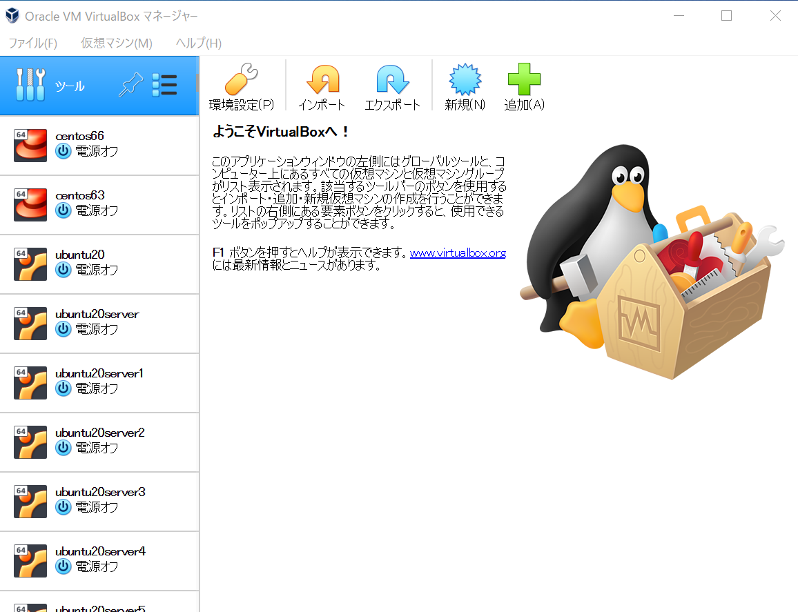

3. 名称の選択

  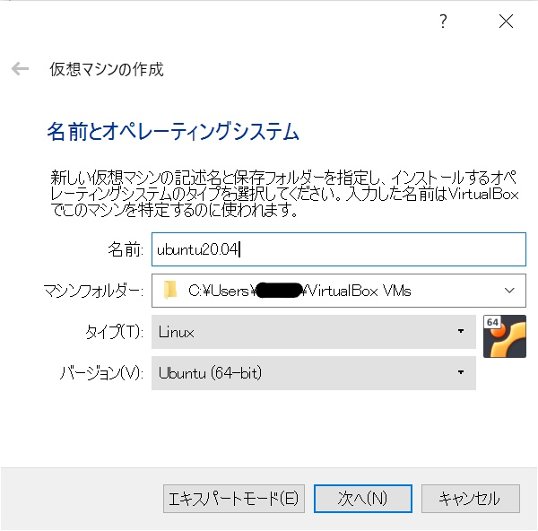

4. メモリサイズの設定

  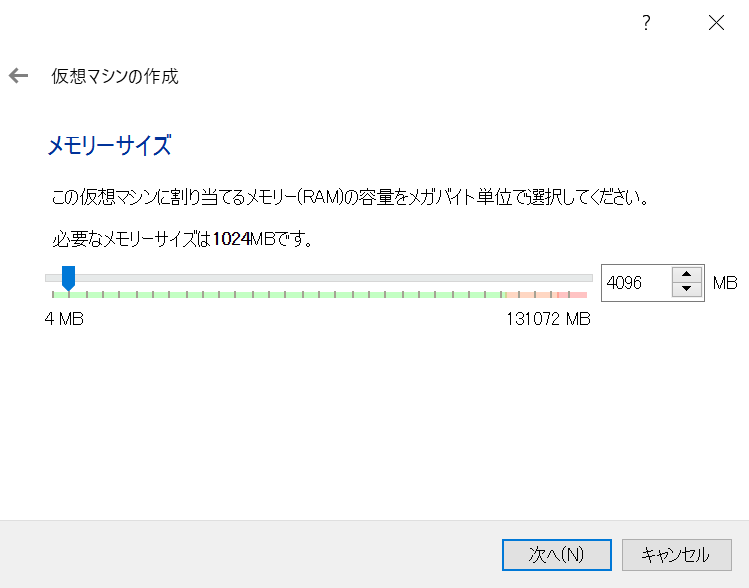

5. ハードディスクの選択

  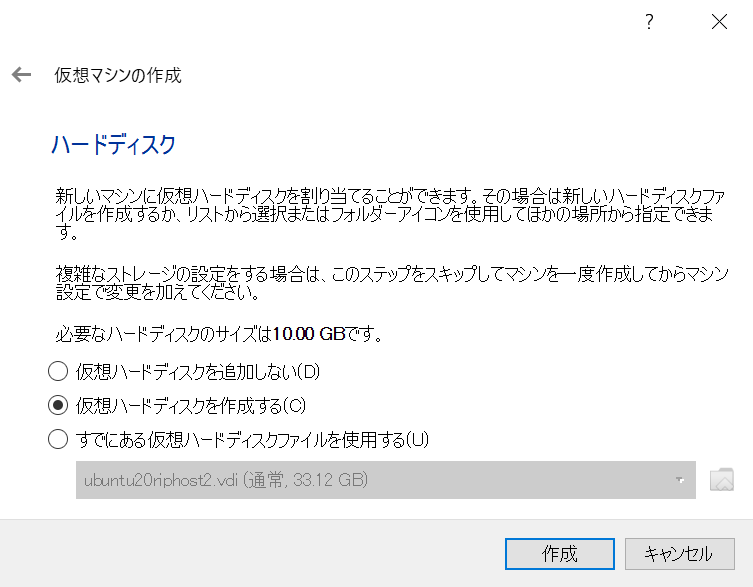

6. ハードディスクのファイルタイプの選択

  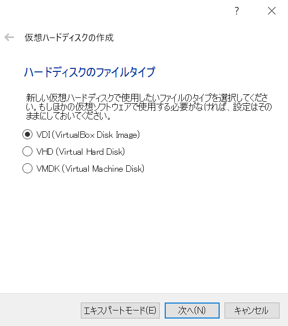

7. 物理ハードディスクの可変、固定の選択

  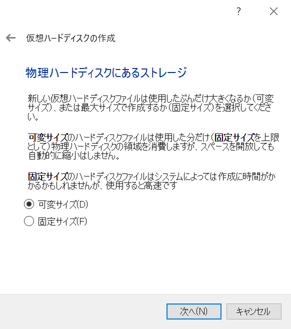

8. 保存先とストレージサイズの設定

  

9. 新規仮想マシンの設定変更

  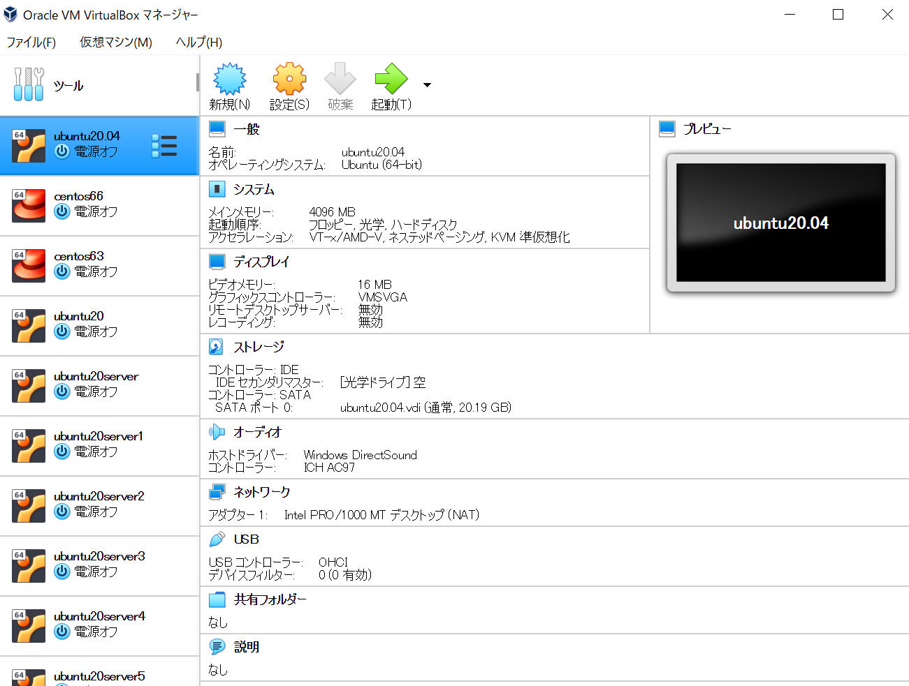

10. ストレージデバイスの選択

  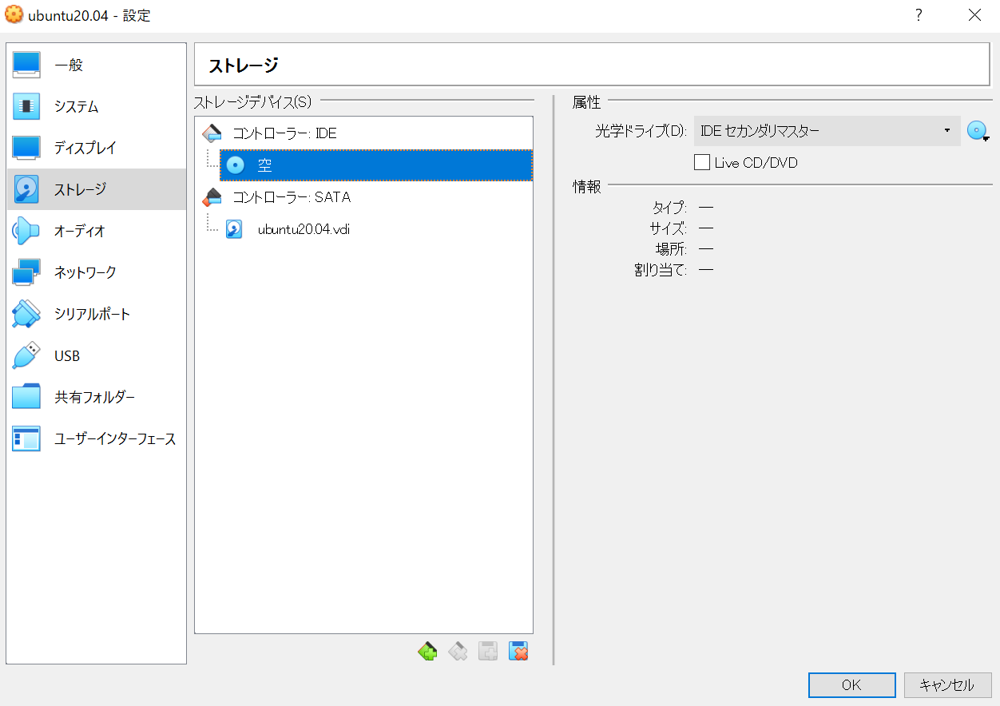

11. ディスクファイルの選択

  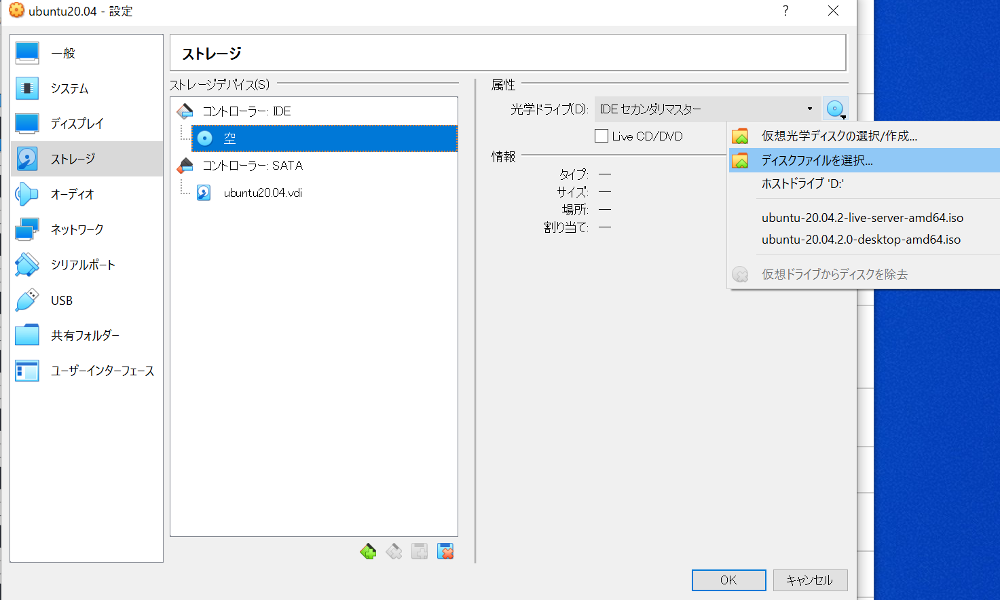
  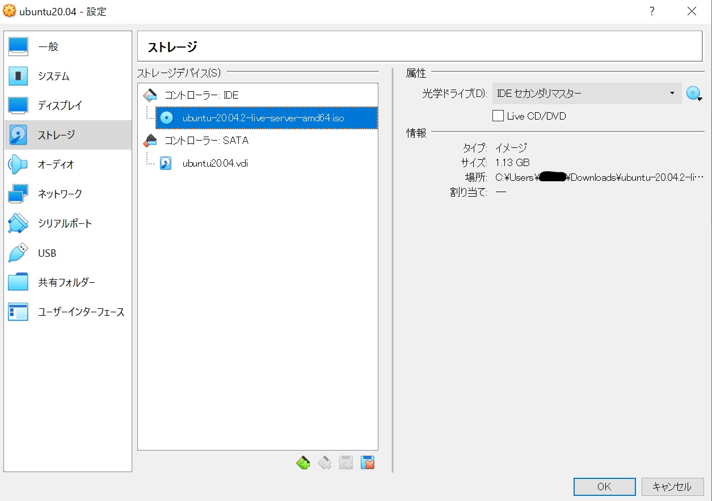

12. マシンの起動 

  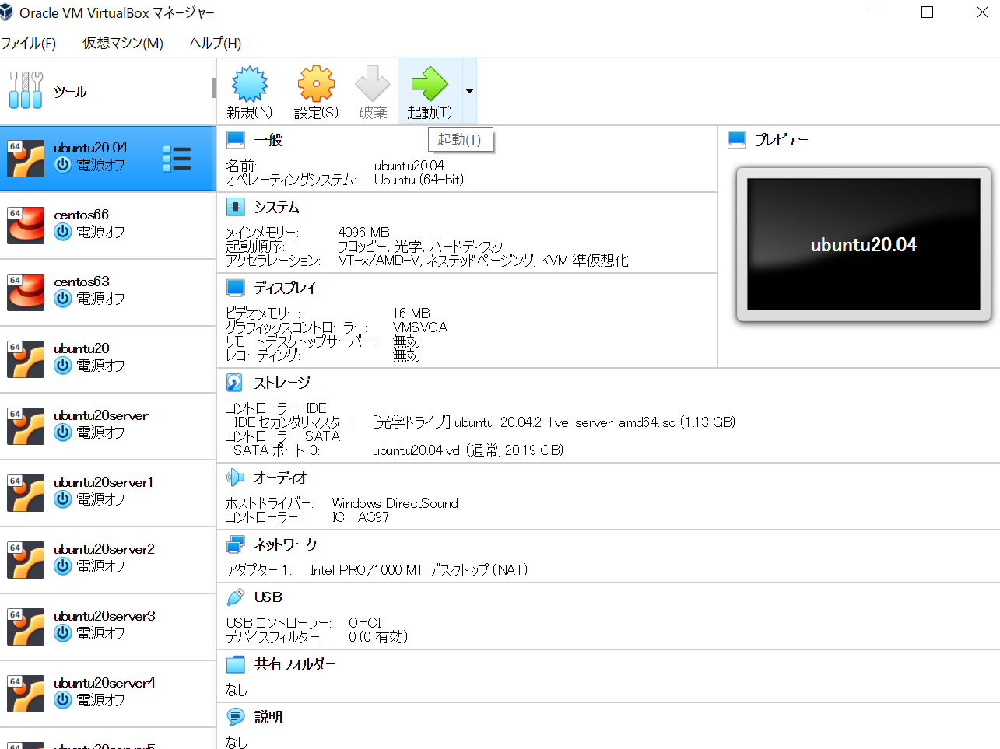

## 次の項目
[ubuntuサーバのインストール方法](../Linux/ubuntu/server_image_installation.md)

## 参考
