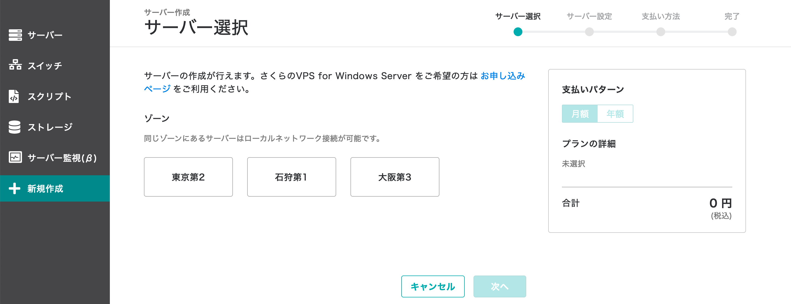
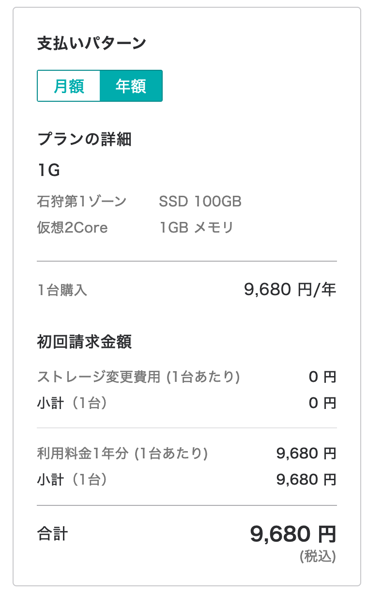
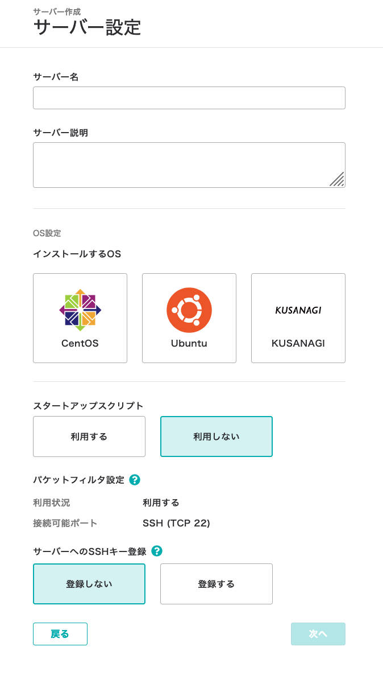
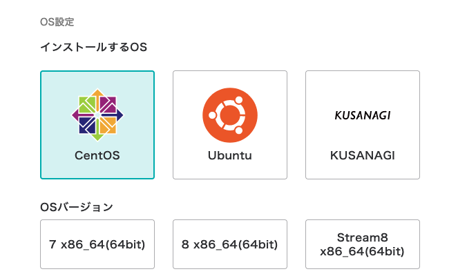
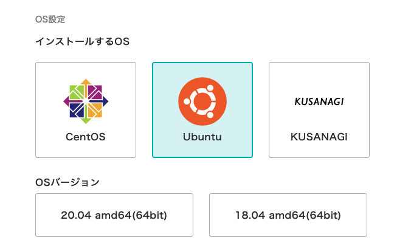
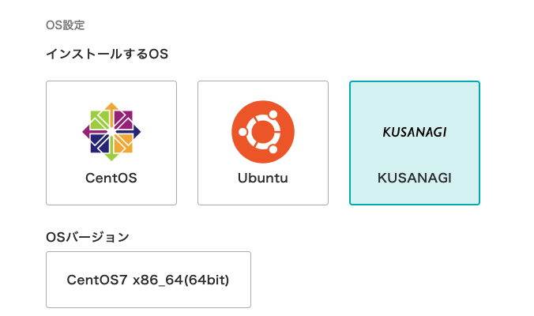
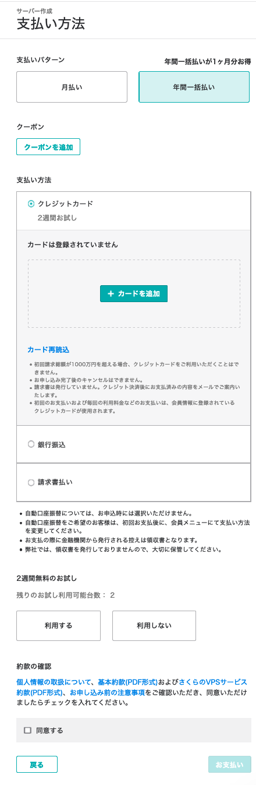

# サーバの作成

さくらVPSの申し込み手順

## 手順

1. サーバの選択

  

2. 構成と金額

  

3. サーバの設定

4. OSの選択

| centOS | ubuntu | KUSANAGI |
| --- | --- | --- |
|  |  |  |
|- centOS7 - centOS8 - centOS stream8 から選択可能| - ubuntu20.04 - ubuntu18.04 から選択可能 | - centOS7 を選択可能 |

5. 支払い方法

## 参考
[さくらVPS](https://vps.sakura.ad.jp/)

## Author
[sudo-roa](https://github.com/sudo-roa)

